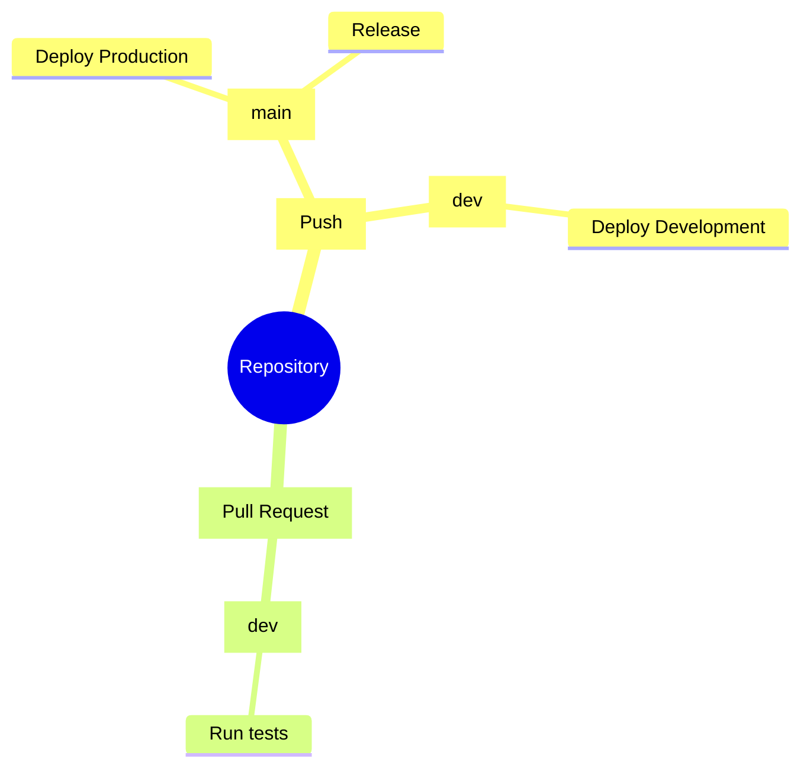
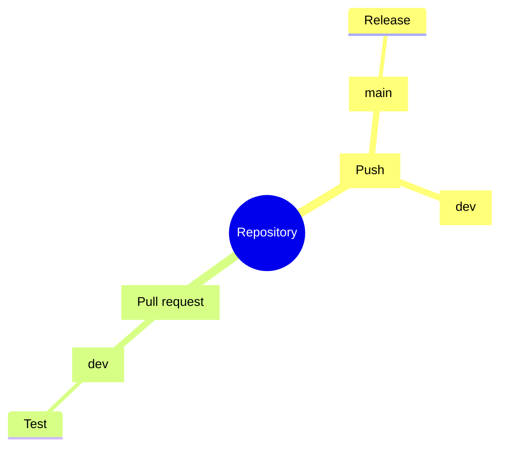
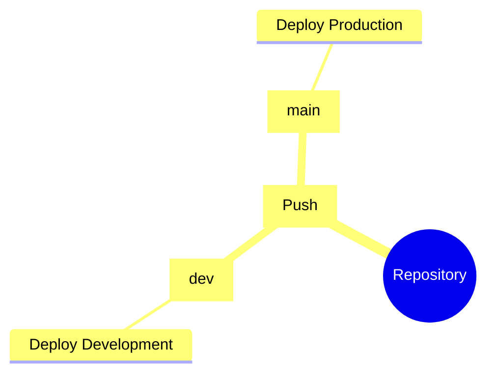

# CI/CD

# Continuous integration (CI)

#### Test
| Feature   | Value             |
| :-------- | :-----------------| 
| Executes  | On **Pull Request** to `dev` |
|Permissions| **Read only** repository contents|

####Release
| Feature   | Value             |
| :-------- | :-----------------| 
|Executes   | On **Pushes** to `main` |
|Permissions| **Read only** repository contents, **Read/Write** releases, **Read/Write** packeges1|

# Continuous deployment

