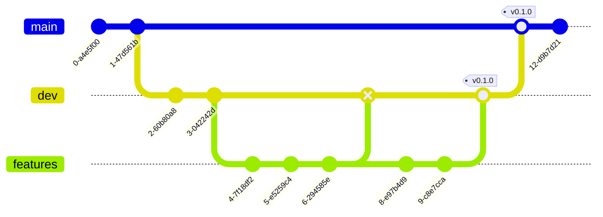

# Contributing
When contributing always follow the conventional commits

# Bramching



# Conventional commits
Commits messages should always be descriptive. Meaning technical descriptions without personal believes or feelings. Commits should always include any of these prefixes:

| **Prefix**   | **Use case**             |
| :------------| :------------------------| 
|`fix:`      | The commit includes fixes for existing bugs.|
|`docs:`      | The commit includes documentation update.|
|`style:`     | The commit includes changes that do not affect the meaning of code.|
|`refactor:`      | The commit include a code change that neither fixes a bug nor adds a feature.|
|`perf:`      | The commit include a code change that improves performance.|
|`test:`      | The commit includes adding missing tests or correcting existing tests.|
|`feat:`      | The commit includes new features to the project.|
|`build:`      | The commit includes changes that affect the build syste, or external dependencies.|
|`ci:`      | The commit includes changes to the Continuous Integration (CI) configuration files and scripts.|
|`chore:`      | The commit include other changes that do not modify src or test files.|
|`revert:`      | The commit include a reverse a previous confirmation.|

Commits should only contain changes related to the prefix used, for example: Never commit feat files with docs files.

Download the **Conventional Commit** extension for ease of use in **Visual Studio Code.**

Commit Examples:

```mermaid
feat: Add user authentication feature
```

```mermaid
fix: Fix issue with login form validationigs
```

```mermaid
docs: Update installation guide
```

```mermaid
refactor: Simplify logic for user authentication
```

```mermaid
chore: Update dependencies to latest versions
```
